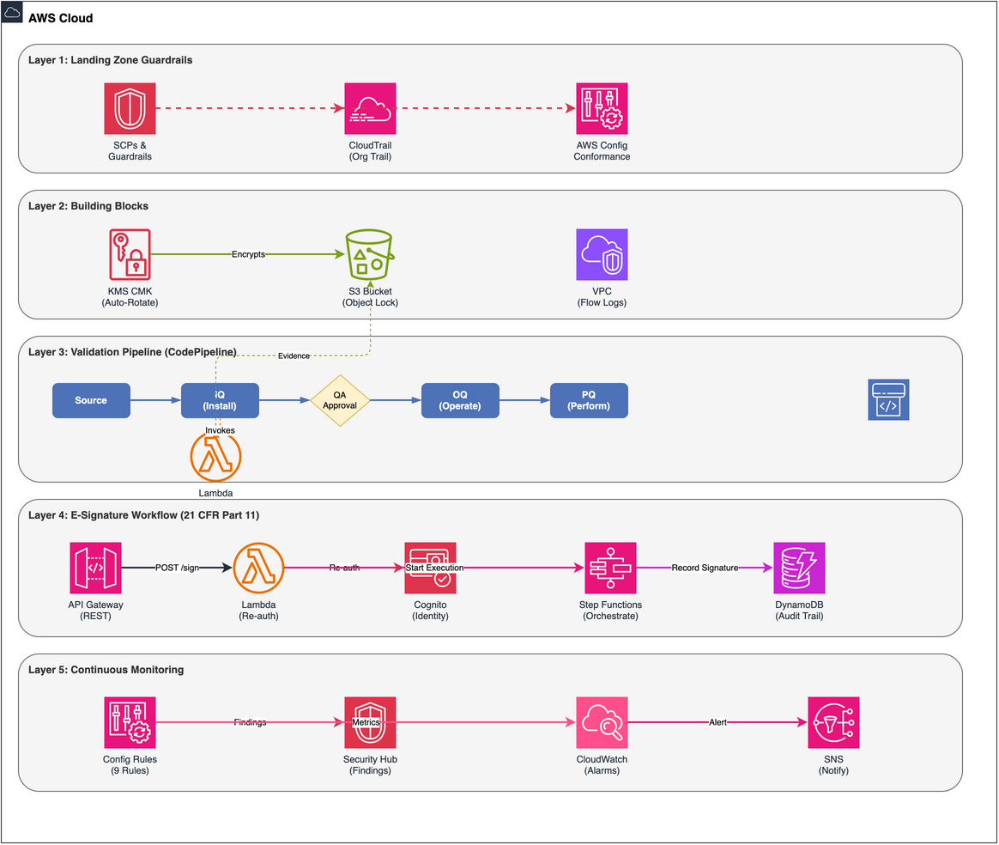

# GxP Compliance Automation on AWS

<!-- Badges -->


---

## Overview

This repository provides **automated GxP compliance infrastructure and validation tooling** for pharmaceutical and life sciences organizations operating on AWS. It delivers Infrastructure-as-Code (IaC) templates, automated qualification pipelines, and electronic signature workflows that align with:

- **FDA Computer Software Assurance (CSA) Guidance** (February 2026) — risk-based thinking applied to computerized system validation
- **ISPE GAMP 5 Second Edition** (2022) — leveraging critical thinking for compliant computerized systems
- **21 CFR Part 11** — Electronic Records and Electronic Signatures
- **EU Annex 11** — Computerized Systems in GMP environments

The solution accelerates time-to-compliance by replacing manual, paper-based validation activities with automated, repeatable, and auditable pipelines — while maintaining the rigor expected by regulatory inspectors.

---

## Architecture

### Architecture Diagram



### Architecture Flow

1. **Landing Zone Guardrails** — Service Control Policies (SCPs), AWS CloudTrail organizational trails, and AWS Config rules establish the foundational compliance boundary. These ensure no GxP workload can operate outside defined guardrails.

2. **Building Blocks** — Reusable, pre-validated infrastructure components (KMS encryption keys, compliant S3 buckets with Object Lock, VPCs with flow logging) that form the base layer for any GxP system.

3. **Validation Pipeline** — A CodePipeline-based CI/CD workflow that automatically executes Installation Qualification (IQ), Operational Qualification (OQ), and Performance Qualification (PQ) stages, generating audit-ready evidence at each step.

4. **E-Signature Workflow** — A 21 CFR Part 11-compliant electronic signature system using Amazon Cognito for identity, AWS Step Functions for workflow orchestration, and DynamoDB for tamper-evident audit trails.

5. **Continuous Monitoring** — Ongoing compliance verification through AWS Config conformance packs and CloudWatch alarms. A drift detection Lambda processes Config compliance change events and publishes findings to AWS Security Hub (primary, auditable record), with Amazon SNS as a secondary alerting channel, so departures from the validated state are recorded and reviewable.

---

## Prerequisites

| Requirement | Version | Notes |
|---|---|---|
| AWS Account | — | With Organizations enabled for Landing Zone features |
| AWS CLI | v2.x | [Install guide](https://docs.aws.amazon.com/cli/latest/userguide/getting-started-install.html) |
| Python | 3.12+ | For Lambda functions and test automation |
| AWS SAM CLI | 1.x | [Install guide](https://docs.aws.amazon.com/serverless-application-model/latest/developerguide/install-sam-cli.html) |
| CloudFormation | — | Built into AWS CLI |
| Docker | 20.x+ | Required for SAM local testing |

Ensure your AWS credentials are configured with sufficient permissions to deploy CloudFormation stacks, create KMS keys, S3 buckets, Lambda functions, Step Functions, DynamoDB tables, and CodePipeline resources.

---

## Deployment

Deploy the stacks in the following order. Each step builds on the previous.

### Step 1: Deploy KMS Key

```bash
aws cloudformation deploy \
  --template-file templates/02-building-blocks/gxp-kms-key.yaml \
  --stack-name gxp-kms-key \
  --parameter-overrides \
      Environment=prod \
      KeyAlias=alias/gxp-compliance-key \
  --capabilities CAPABILITY_NAMED_IAM \
  --tags Project=GxPCompliance Environment=prod
```

### Step 2: Deploy Compliant Storage Building Block

```bash
aws cloudformation deploy \
  --template-file templates/02-building-blocks/gxp-compliant-storage.yaml \
  --stack-name gxp-compliant-storage \
  --parameter-overrides \
      Environment=prod \
      KmsKeyArn=$(aws cloudformation describe-stacks \
        --stack-name gxp-kms-key \
        --query 'Stacks[0].Outputs[?OutputKey==`KmsKeyArn`].OutputValue' \
        --output text) \
      RetentionDays=2555 \
      ObjectLockMode=GOVERNANCE \
  --capabilities CAPABILITY_NAMED_IAM
```

### Step 3: Deploy AWS Config Conformance Pack

```bash
aws configservice put-conformance-pack \
  --conformance-pack-name GxP-Compliance-Pack \
  --template-body file://templates/03-conformance-pack/gxp-conformance-pack.yaml \
  --delivery-s3-bucket $(aws cloudformation describe-stacks \
    --stack-name gxp-compliant-storage \
    --query 'Stacks[0].Outputs[?OutputKey==`ConfigBucketName`].OutputValue' \
    --output text)
```

### Step 4: Deploy E-Signature Stack

```bash
aws cloudformation deploy \
  --template-file templates/05-e-signature/e-signature-stack.yaml \
  --stack-name gxp-e-signature \
  --parameter-overrides \
      Environment=prod \
      KmsKeyArn=$(aws cloudformation describe-stacks \
        --stack-name gxp-kms-key \
        --query 'Stacks[0].Outputs[?OutputKey==`KmsKeyArn`].OutputValue' \
        --output text) \
      SignatureRetentionDays=2555 \
      MfaRequired=true \
  --capabilities CAPABILITY_NAMED_IAM
```

### Step 5: Package and Deploy IQ Verification Lambda

```bash
cd src/iq-verification

# Install dependencies
pip install -r requirements.txt -t ./package

# Package with SAM
sam build

# Deploy
sam deploy \
  --stack-name gxp-iq-verification \
  --s3-bucket $(aws cloudformation describe-stacks \
    --stack-name gxp-compliant-storage \
    --query 'Stacks[0].Outputs[?OutputKey==`ArtifactBucketName`].OutputValue' \
    --output text) \
  --capabilities CAPABILITY_IAM \
  --parameter-overrides \
      Environment=prod \
      KmsKeyArn=$(aws cloudformation describe-stacks \
        --stack-name gxp-kms-key \
        --query 'Stacks[0].Outputs[?OutputKey==`KmsKeyArn`].OutputValue' \
        --output text)

cd ../..
```

### Step 6: Deploy Validation Pipeline

```bash
aws cloudformation deploy \
  --template-file templates/04-validation-pipeline/pipeline-high-risk.yaml \
  --stack-name gxp-validation-pipeline \
  --parameter-overrides \
      Environment=prod \
      SourceRepository=gxp-compliance-automation \
      IQFunctionArn=$(aws cloudformation describe-stacks \
        --stack-name gxp-iq-verification \
        --query 'Stacks[0].Outputs[?OutputKey==`IQFunctionArn`].OutputValue' \
        --output text) \
      ArtifactBucket=$(aws cloudformation describe-stacks \
        --stack-name gxp-compliant-storage \
        --query 'Stacks[0].Outputs[?OutputKey==`ArtifactBucketName`].OutputValue' \
        --output text) \
      ApprovalNotificationTopic=arn:aws:sns:us-east-1:ACCOUNT_ID:gxp-approvals \
  --capabilities CAPABILITY_NAMED_IAM
```

### Step 7: Package and Deploy Drift Detection Stack

The drift detection Lambda processes AWS Config compliance change events. On a
NON_COMPLIANT evaluation it publishes a custom finding to AWS Security Hub
(primary, auditable record) and an alert to Amazon SNS (secondary), escalating
high-process-risk resources to a separate critical topic.

Prerequisites: AWS Security Hub must be enabled in the deployment account and
Region. If Security Hub is not enabled, set `SecurityHubEnabled=false` to route
alerts to SNS only.

```bash
# Package the Lambda and upload it to the artifact bucket
make package
aws s3 cp dist/drift-detection.zip s3://$(aws cloudformation describe-stacks \
  --stack-name gxp-compliant-storage \
  --query 'Stacks[0].Outputs[?OutputKey==`ArtifactBucketName`].OutputValue' \
  --output text)/drift-detection/handler.zip

aws cloudformation deploy \
  --template-file templates/06-drift-detection/gxp-drift-detection.yaml \
  --stack-name gxp-drift-detection \
  --parameter-overrides \
      Environment=prod \
      LambdaCodeBucket=$(aws cloudformation describe-stacks \
        --stack-name gxp-compliant-storage \
        --query 'Stacks[0].Outputs[?OutputKey==`ArtifactBucketName`].OutputValue' \
        --output text) \
      SecurityHubEnabled=true \
  --capabilities CAPABILITY_NAMED_IAM
```

---

## Testing

### Unit Tests

```bash
# Install test dependencies
pip install -r requirements-dev.txt

# Run all unit tests
pytest tests/ -v --cov=src --cov-report=html

# Run specific test module
pytest tests/unit/test_iq_verification.py -v
```

### Integration Tests

```bash
# Run integration tests against deployed stacks
pytest tests/integration/ -v \
  --env prod \
  --stack-prefix gxp

# Run e-signature workflow tests
pytest tests/integration/test_e_signature_workflow.py -v
```

### Compliance Verification

```bash
# Verify Config conformance pack compliance
aws configservice get-conformance-pack-compliance-summary \
  --conformance-pack-names GxP-Compliance-Pack
```

---

## Cleanup

Delete stacks in **reverse order** to avoid dependency errors:

```bash
# 1. Delete drift detection stack
aws cloudformation delete-stack --stack-name gxp-drift-detection
aws cloudformation wait stack-delete-complete --stack-name gxp-drift-detection

# 2. Delete validation pipeline
aws cloudformation delete-stack --stack-name gxp-validation-pipeline
aws cloudformation wait stack-delete-complete --stack-name gxp-validation-pipeline

# 3. Delete IQ verification Lambda
aws cloudformation delete-stack --stack-name gxp-iq-verification
aws cloudformation wait stack-delete-complete --stack-name gxp-iq-verification

# 4. Delete e-signature stack
aws cloudformation delete-stack --stack-name gxp-e-signature
aws cloudformation wait stack-delete-complete --stack-name gxp-e-signature

# 5. Delete conformance pack
aws configservice delete-conformance-pack \
  --conformance-pack-name GxP-Compliance-Pack

# 6. Delete compliant storage (NOTE: empty buckets first)
aws s3 rm s3://BUCKET_NAME --recursive  # Repeat for each bucket
aws cloudformation delete-stack --stack-name gxp-compliant-storage
aws cloudformation wait stack-delete-complete --stack-name gxp-compliant-storage

# 7. Delete KMS key (scheduled for deletion)
aws cloudformation delete-stack --stack-name gxp-kms-key
aws cloudformation wait stack-delete-complete --stack-name gxp-kms-key
```

> **Note:** KMS keys have a mandatory waiting period (7–30 days) before actual deletion. S3 buckets with Object Lock may require governance-mode bypass permissions to empty.

---

## Blog Reference

This repository is the companion to the AWS Security Blog post:

> **[Accelerating Pharma Innovation: Automated GxP Compliance and Security Controls on AWS](https://aws.amazon.com/blogs/security/)**

The blog post provides context on the regulatory landscape, design decisions, and how this automation framework fits into a broader GxP compliance strategy.

---

## Repository Structure

```
gxp-compliance-automation/
├── docs/
│   ├── architecture.drawio
│   ├── architecture.png
│   ├── system-boundary-template.md
│   └── validation-artifact-mapping.md
├── src/
│   ├── drift-detection/
│   │   ├── handler.py
│   │   └── requirements.txt
│   ├── e-signature/
│   │   ├── reauth_lambda.py
│   │   ├── requirements.txt
│   │   ├── signature_record_lambda.py
│   │   └── step_functions_definition.json
│   ├── iq-verification/
│   │   ├── checks/
│   │   │   ├── __init__.py
│   │   │   ├── encryption_access.py
│   │   │   ├── iam_trust.py
│   │   │   ├── integration_endpoints.py
│   │   │   └── network_connectivity.py
│   │   ├── handler.py
│   │   └── requirements.txt
│   └── rtm-generator/
│       ├── generate_rtm.py
│       └── requirements.txt
├── templates/
│   ├── 01-landing-zone/
│   │   ├── gxp-scp-preventive-controls.json
│   │   └── organization-config-excerpt.yaml
│   ├── 02-building-blocks/
│   │   ├── gxp-compliant-storage.yaml
│   │   └── gxp-kms-key.yaml
│   ├── 03-conformance-pack/
│   │   └── gxp-conformance-pack.yaml
│   ├── 04-validation-pipeline/
│   │   └── pipeline-high-risk.yaml
│   ├── 05-e-signature/
│   │   └── e-signature-stack.yaml
│   └── 06-drift-detection/
│       └── gxp-drift-detection.yaml
├── tests/
│   ├── conftest.py
│   ├── test_drift_detection.py
│   ├── test_e_signature.py
│   └── test_iq_verification.py
├── CONTRIBUTING.md
├── LICENSE
├── Makefile
└── README.md
```

---

## Security

See [CONTRIBUTING.md](CONTRIBUTING.md) for more information.

> ⚠️ **Important:** This repository is provided as a reference implementation and educational resource. Do **not** deploy to production GxP-regulated environments without thorough review by your quality assurance team, validation specialists, and regulatory affairs personnel. Your organization's specific regulatory requirements, risk assessments, and quality management system must govern the final implementation.

If you discover a potential security issue, please do **not** create a public GitHub issue. Instead, follow the [AWS Vulnerability Reporting](https://aws.amazon.com/security/vulnerability-reporting/) process.

---

## License

This project is licensed under the MIT-0 (No Attribution) License. See the [LICENSE](LICENSE) file for details.

---

## Authors

- **Abhishek Agawane** — *Initial work and architecture*
